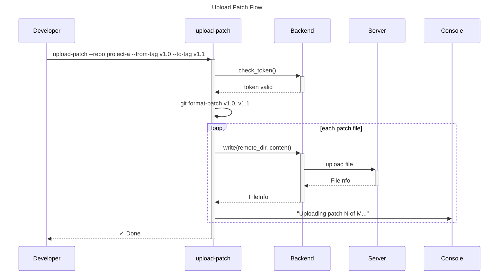
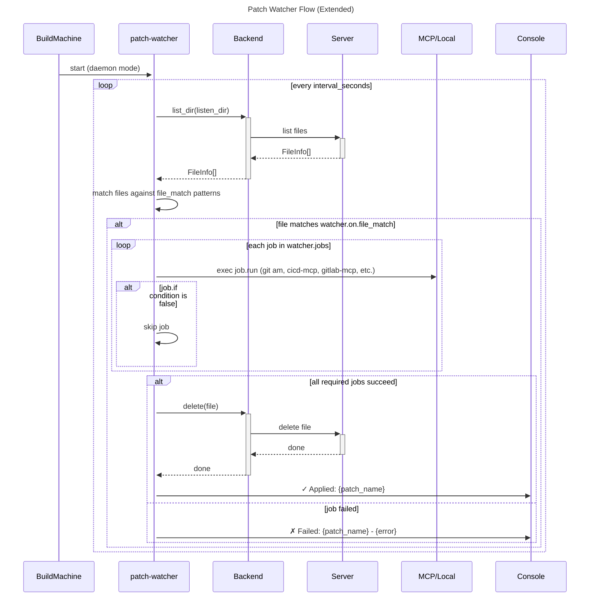
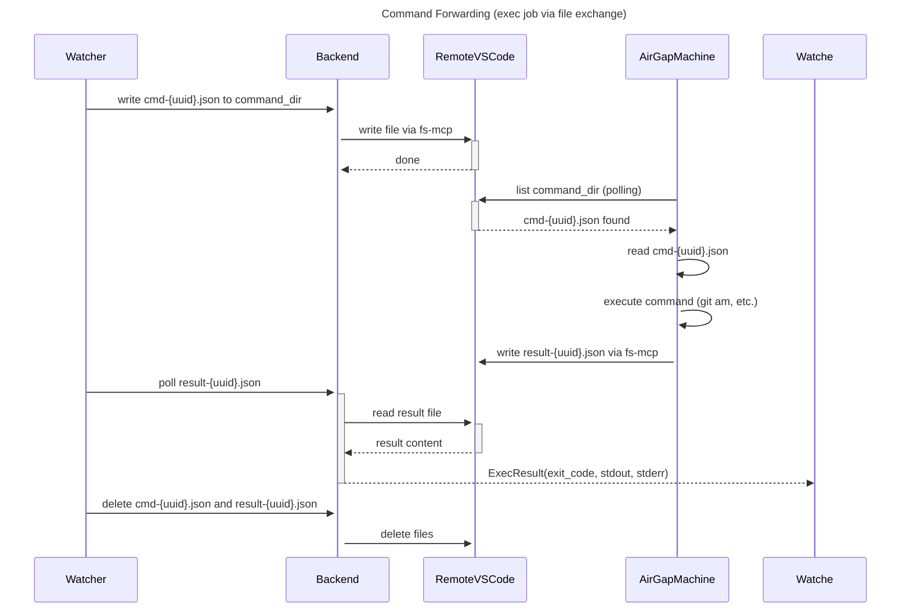

# Patch Transfer System

## Summary

A two-part CLI toolchain for transferring git patches across network boundaries: `upload-patch` pushes patches from a local repo to a remote file server via configurable backends, and `patch-watcher` polls the remote server and triggers user-defined jobs (GitHub Actions style workflow) on the local machine. A separate `trigger-ci` command provides optional CI pipeline triggering from the local machine.

---

## Problem Frame

When developing across a restricted internal network, developers work locally on their own machines but need to sync completed patches to intranet build machines that have no direct access to the developer's workstation. A file transfer bridge is needed that works with existing infrastructure (fs-mcp or JumpServer) and requires minimal manual intervention. The auth flow for these file servers requires human verification (captcha / 2FA), so token acquisition must be interactive but not repeated for every operation. After patches are applied, additional steps (branch creation, PR, merge) are handled by MCP integrations on the intranet machine.

---

## Actors

- A1. **Developer**: Runs `upload-patch` locally after completing a set of commits; optionally runs `trigger-ci` locally
- A2. **Intranet build machine**: Runs `patch-watcher`, applies patches to target repos, creates branches/PRs via MCP

---

## Key Flows

- F1. **Upload patch to remote server**
  - **Trigger:** Developer runs `upload-patch --repo <name> --from-tag <tag> --to-tag <tag>`
  - **Actors:** A1, A2 (indirectly)
  - **Steps:** CLI reads config → determines remote_dir → runs `git format-patch` → uploads files to backend → reports success/failure
  - **Outcome:** Patch files exist on the remote server, available for polling

- F2. **Watch and apply patches**
  - **Trigger:** patch-watcher detects new files matching `on.file_match` patterns
  - **Actors:** A2
  - **Steps:** Loop over configured watchers → list remote_dir → match files against `file_match` patterns → for each matched file, run jobs in order → on success, delete remote file
  - **Outcome:** Patches applied, branches/PRs created if configured, remote file cleaned up

- F3. **Auth token acquisition**
  - **Trigger:** Token expired or not found
  - **Actors:** A1, A2
  - **Steps:** CLI launches local HTTP proxy → sets HTTP_PROXY env var → opens browser to login page → user completes login manually (including captcha) → proxy intercepts cookie with configured name → CLI saves token locally
  - **Outcome:** Token cached with expiry, CLI proceeds

- F4. **Trigger CI pipeline (optional local command)**
  - **Trigger:** Developer runs `trigger-ci --repo <name> --branch <branch>`
  - **Actors:** A1
  - **Steps:** CLI calls CI/CD platform MCP to trigger pipeline on specified branch
  - **Outcome:** CI pipeline starts on the feature branch





```mermaid
sequenceDiagram
    title: Auth Flow (Token Acquisition)

    CLI->>+CLI: start local proxy on port 8080

    CLI->>Environment: set HTTP_PROXY=localhost:8080

    CLI->>Browser: webbrowser.open(login_url)

    User->>+Browser: login with captcha
    Browser->>+Server: POST credentials
    Server-->>-Browser: Set-Cookie: code-server-session=xxx
    Browser-->>-User: login success

    Proxy->>+Server: GET login_url
    Server-->>-Proxy: redirect to app
    Proxy->>Proxy: capture Set-Cookie header

    Proxy-->>-CLI: token captured
    CLI->>CLI: save token to ~/.patch-transfer/token.json

    CLI->>Environment: unset HTTP_PROXY
    CLI->>Console: ✓ Auth success
```



---

## Requirements

**Configuration**

- R1. All configuration lives in a single YAML file, shared by all tools (upload-patch, patch-watcher, trigger-ci)
- R2. Config file path is configurable via CLI flag (`--config <path>`) and defaults to `~/.patch-transfer/config.yaml`
- R3. Config follows GitHub Actions-inspired workflow syntax with `name`, `on`, `jobs`, `run`, `if` constructs
- R4. Config supports `upload.repos` section mapping repo names to local paths and remote directories
- R5. Config supports `backend` section specifying `type` (`fs-mcp`, `jumpserver`, or `local`) and its connection parameters
- R5a. `local` backend writes/reads/deletes files directly on the local filesystem without network calls. Suitable when upload-patch runs on the same machine as the file storage (e.g., remote VSCode server).
- R5b. `fs-mcp` and `local` backends support command forwarding via file exchange. `jumpserver` backend does not support command forwarding (only upload/download).
- R6. Config supports `watchers` section with multiple watcher entries, each defining `name`, `on.file_match`, and `jobs`

**Backend abstraction**

- R7. File transfer operations are exposed via a `FileTransferBackend` interface with: `list_dir`, `read`, `write`, `delete`
- R8. Switching backend type in config changes the behavior without changing CLI behavior
- R9. Each backend handles its own auth (token loading, refresh, proxy) independently

**Upload patch**

- R10. `upload-patch` accepts `--repo`, `--from-tag`, `--to-tag` arguments
- R11. If `--from-tag` / `--to-tag` omitted, uses most recent tag → HEAD
- R12. Generated patch files are uploaded to the backend's `remote_dir` for the specified repo
- R13. CLI reports progress: "Uploading patch N of M..."
- R14. CLI returns non-zero exit code on any failure

**Patch watcher (workflow-style)**

- R15. `patch-watcher` runs as a daemon (continuous polling) by default; `--once` flag runs single iteration and exits
- R16. Polling interval is configurable via `interval_seconds` in config (default: 60)
- R17. Watcher `on.file_match` is a glob pattern (e.g., `*.patch`, `*--pr.patch`) used to filter which files trigger the watcher
- R18. Jobs execute in order as defined in the config; each job has `id`, `name` (optional), `type`, and relevant fields based on type
- R19. Job `type` determines execution mode:
  - `exec` — Execute command via file exchange protocol (on air-gap machine)
  - `run` — Execute inline script locally
- R20. Job `if` condition supports `jobs.<id>.success` / `jobs.<id>.failure` references
- R21. Built-in variables available in job fields:
  - `{patch_path}` — local temp file path
  - `{patch_name}` — filename (contains user-defined flags for custom parsing in scripts)
  - `{patch_dir}` — local temp directory
  - `{timestamp}` — ISO format timestamp
  - `{repo_path}` — mapped from upload repos config
  - `{branch_name}` — parsed from patch_name by user scripts
  - `{patch_remote_path}` — remote file path (for deletion)
- R22. On job failure, remaining jobs are skipped; remote file is left untouched
- R23. On all required jobs success, remote file is deleted via backend
- R24. Business logic (git am, cicd-mcp calls, gitlab-mcp calls, etc.) is defined in job configs, not in the tool itself — tool is a job executor only

**Command forwarding (exec job type)**

- R25. `exec` job type uses file exchange protocol to execute commands on air-gap machine
- R26. Command files are written to `command_dir` (configured in backend): `cmd-{uuid}.json`
- R27. Result files are read from `command_dir`: `result-{uuid}.json`
- R28. Command file format:
  ```json
  {
    "id": "uuid",
    "cmd": "git am --3way /tmp/patch.patch",
    "cwd": "/path/to/repo",
    "timeout": 300
  }
  ```
- R29. Result file format:
  ```json
  {
    "id": "uuid",
    "exit_code": 0,
    "stdout": "...",
    "stderr": "...",
    "completed_at": "2026-05-25T10:00:00Z"
  }
  ```
- R30. `exec` job polls for result file until timeout or completion
- R31. A lightweight `command-responder` service runs on air-gap machine, polling `command_dir` for new command files, executing them, and writing results

**Auth token**

- R32. Auth method is configured per backend (`method: proxy`)
- R33. Config specifies `login_url`, `token_cookie_name`, `proxy_port`
- R34. Token is cached to `token_cache_file` (default: `~/.patch-transfer/token.json`) with expiry timestamp
- R35. Before any backend operation, CLI checks token validity; if expired or missing, triggers auth flow
- R36. Auth flow: start local proxy → set HTTP_PROXY env vars → open browser via `webbrowser.open()` → intercept Set-Cookie headers → extract configured cookie name → save to cache
- R37. Auth flow times out after 5 minutes; user can cancel and retry
- R38. Auth flow provides a fallback "paste token manually" option if proxy interception fails

**Trigger CI**

- R39. `trigger-ci` is a separate optional command for local use
- R40. `trigger-ci` accepts `--repo` and `--branch` arguments
- R41. `trigger-ci` calls the configured CI/CD platform MCP to trigger pipeline on the specified branch

---

## Configuration Format (Reference)

```yaml
# ========== Global Config ==========
name: patch-transfer
version: 1

# ========== Backend ==========
backend:
  type: fs-mcp
  config:
    url: $FS_MCP_URL
    transport: streamable-http
    headers:
      Cookie: $FS_MCP_COOKIE

# ========== Auth ==========
auth:
  method: proxy
  login_url: $LOGIN_URL
  token_cookie_name: code-server-session
  proxy_port: 8080
  token_cache_file: ~/.patch-transfer/token.json

# ========== Upload Repos ==========
upload:
  repos:
    project-a:
      path: /path/to/repo-a
      remote_dir: /patches/project-a

# ========== Watchers (workflow-style) ==========
watchers:
  - name: Apply & Push (local exec)
    on:
      file_match: "*.patch"
    jobs:
      - id: apply
        name: Apply patch
        type: exec
        cmd: git am --3way {patch_path}
        cwd: $REPO_PATH

      - id: push
        name: Push to develop
        type: exec
        cmd: git push origin develop
        cwd: $REPO_PATH

      - id: cleanup
        name: Cleanup remote file
        if: jobs.apply.success
        type: file_delete
        path: {patch_remote_path}

  - name: Apply & Create PR (via exec on air-gap)
    on:
      file_match: "*--pr.patch"
    jobs:
      - id: apply
        type: exec
        cmd: git am --3way {patch_path}
        cwd: $REPO_PATH

      - id: create-branch
        type: exec
        cmd: cicd-mcp.create-branch name={branch_name} from=develop

      - id: create-pr
        type: exec
        cmd: gitlab-mcp.create-pr source=develop target={branch_name}

      - id: merge
        if: jobs.create-pr.success
        type: exec
        cmd: gitlab-mcp.merge source=develop target={branch_name}

# ========== CI/CD MCP Config ==========
cicd:
  mcp_server: cicd-mcp
  api_url: $CICD_API_URL
```

---

## Acceptance Examples

- AE1. **Covers R10, R12, R13.** Given config with `upload.repos.project-a.remote_dir: /patches/project-a`, when developer runs `upload-patch --repo project-a --from-tag v1.0 --to-tag v1.1`, then CLI generates patch files covering commits between v1.0 and v1.1 (exclusive of v1.0, inclusive of v1.1), uploads each to `/patches/project-a`, and prints "Uploading patch 1 of 3..." → "✓ Done."
- AE2. **Covers R15, R17, R18, R22, R23.** Given patch-watcher running with a watcher matching `*.patch` and jobs `[apply, push, cleanup]`, when a new patch file `0001-v1.0.patch` appears in the listen directory, then watcher applies it, pushes, and deletes the remote file. When a file `0002-v1.0--pr.patch` appears and matches a different watcher, that watcher's jobs run instead.
- AE3. **Covers R36.** Given expired token and proxy config for `code-server-session` cookie, when user triggers any CLI operation, then CLI starts proxy on port 8080, sets HTTP_PROXY env, opens browser to login_url, waits for cookie capture, saves token, and proceeds — without requiring user to re-enter credentials for 30 days.
- AE4. **Covers R39, R40.** Given configured cicd.mcp_server and repo `project-a` with branch `feature/xyz`, when developer runs `trigger-ci --repo project-a --branch feature/xyz`, then CLI calls the CI/CD MCP to trigger pipeline on that branch.
- AE5. **Covers R25-R30.** Given patch-watcher with `exec` job type and `command-responder` running on air-gap machine, when watcher encounters a new patch file, it writes `cmd-{uuid}.json` to `command_dir` via fs-mcp. The responder reads the command file, executes it locally (e.g., `git am --3way`), writes `result-{uuid}.json`, and watcher returns the execution result. Watcher then deletes both files.

---

## Success Criteria

- A developer can upload patches from any local repo to any configured remote directory in one command
- A build machine can be configured to watch multiple directories with different workflow triggers, fully automated once running
- Auth token needs to be acquired manually once per expiry period; subsequent operations are silent
- Switching from fs-mcp to JumpServer requires only changing `backend.type` in config, no code changes
- Failed job leaves the remote file intact for retry or manual intervention
- Business logic is fully configurable in `run` scripts; tool provides only job execution framework
- `trigger-ci` provides a convenient local interface to the CI/CD MCP

---

## Scope Boundaries

**Deferred for later:**
- Notification on action failure (Slack/email)
- Automated retry on patch conflict
- Persistent job state across watcher restarts
- Webhook-based push notifications (vs polling)

**Outside this product's identity:**
- Server-side modifications (adding callback endpoints, token display pages)
- Multiple auth methods beyond proxy-intercepted cookie
- Direct MCP integration in upload-patch (patches are files, not MCP calls)

---

## Key Decisions

- **Separate CLI programs, shared config:** upload-patch, patch-watcher, and trigger-ci are independent; the shared config file is the integration point. This avoids coupling and allows different run schedules.
- **Workflow-style job executor:** patch-watcher is a generic job execution engine. Business logic lives in job configs (`exec`, `run`, `file_delete`) and `if` conditions. The tool does not hardcode any business operations.
- **File-match trigger pattern:** Watchers are triggered by file name glob patterns, not by content. Users can embed flags in patch filenames; scripts parse `{patch_name}` to decide behavior.
- **In-memory processed-file tracking:** patch-watcher tracks which files have been processed in memory (not persisted). On restart, it may re-process files from the last polling interval. Acceptable for v1 since re-application of git am to the same patch fails gracefully.
- **Job failure = leave file:** On any job failure, the remote file is not deleted. This gives users a chance to investigate without losing the payload.
- **Command forwarding via file exchange:** `exec` job type writes command files to `command_dir` and polls for result files. The air-gap machine runs a lightweight `command-responder` service that processes these files. This allows command execution without MCP support on the file transfer backend.
- **Backend command forwarding capability:** `fs-mcp` and `local` backends support `exec` job type. `jumpserver` backend does not support command forwarding (only file operations).

---

## Dependencies / Assumptions

- fs-mcp / JumpServer backend exposes list_dir, read, write, delete operations via an API
- `command-responder` service runs on air-gap machine, polling `command_dir` for new command files
- Git is available on the air-gap machine, with configured remotes for push
- Developers have network access from their machine to the remote file server
- The air-gap machine has network access to the remote file server (via fs-mcp client connection)
- Proxy interception works for the target login page's Set-Cookie response structure
- CI/CD MCP and GitLab MCP are available and configured on the air-gap machine
- User scripts in job configs are responsible for parsing `{patch_name}` to extract any custom flags

---

## Outstanding Questions

### Resolve Before Planning

- **None at this time.**

### Deferred to Planning

- **R28** [Needs research] What MCP call syntax does the CI/CD MCP and GitLab MCP expect — JSON-RPC style, CLI style, or HTTP style? This affects how `exec` job commands are formatted.
- **R31** [Technical] `command-responder` implementation details: polling interval, error handling, logging, and startup configuration on air-gap machine.