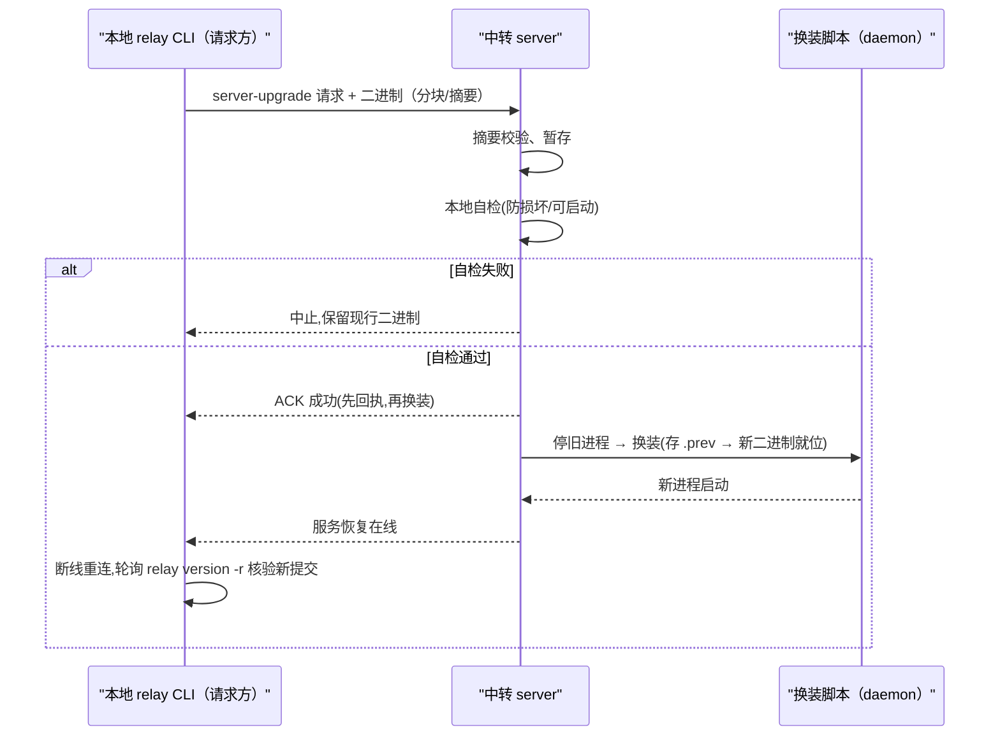
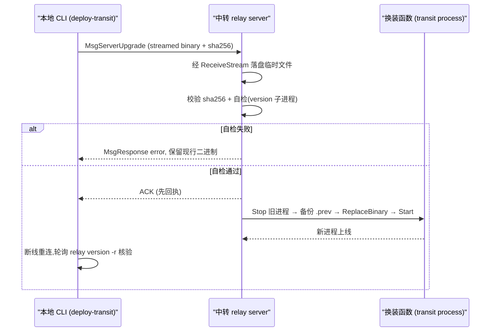

# 中转一键自动部署 - Plan

## Goal Capsule

- **Objective:** 给中转服务器新增一条「受控自升级」协议通道，让 `make deploy` 对中转也做到一键全自动：本地构建 → 经中转现有流式校验交付新二进制 → 中转先自检再原子换装重启 → 版本台账核验。只放开「自我升级」这一条窄径，不让中转具备任意执行能力。
- **Product authority:** 本计划只负责中转自动部署这一段；远端执行器部署（已有，保持现状）、WS 子命令、config-sync 等不在本计划内改。
- **Open blockers:** 无。三个方向性决策（一键全自动 / 先自检再换装 / 受控升级消息通道）已在对话中由用户确定。

---

## Product Contract

### Summary

为 relay 协议新增一处由「中转本地处理」的「服务器自升级」消息：客户端把新构建的二进制复用现有流式分块 + sha256 摘要校验交付给中转，中转在本地自检通过后把现行二进制保存为备件并原子换装重启。据此把 `deploy-transit` 从「打印手工 code-server 清单」升级为「一键全自动」；仍只做自我升级，不做任意命令执行。

### Problem Frame

远端透执行的部署已经是全自动的：经中转 `push --no-jobs --dest` 把新二进制下发到执行器，RESTART=1 时 detached 换装重启，再用 `relay version -r` 核验台账。唯独中转盒子仍是半自动——SSH 不可达、非执行器、relay 只做文件交换，所以每次升级都要靠 code-server web 人工上传二进制，再手动敲一条 `relay server upgrade` 收尾。而 relay 的中转内置了完整的本地 self-update（`daemonUpgrade` → `ReplaceBinary` → 重启，见 `cmd/relay/main.go` 与 `cmd/relay/server.go`），缺的只是「把新二进制从客户端送达中转盒子的即时入口」。补齐这个入口，中转升级就不再依赖人手。

### Requirements

**通道与信任边界**

- R1. 新增一条「服务器自升级」消息，由中转本地处理，不做任意命令转发或本地执行；仅对已完成鉴权（现有连接握手 token）的客户端开放。
- R2. 升级通道的鉴权为**硬约束**：未通过 `validateToken` 的会话一律拒绝该消息。仅当服务器显式配置了 token 时，升级通道才可用；未配置 token 时升级通道**默认关闭**——与既有「无 token 即放行」的文件交换姿态显式区分，升级通道不受其约束。（真实性的信任边界：见 R4/R5 的说明，Token 持有者可替换+重启中转，属已知且评分过的信任扩展。）
- R3. 升级通道的「受控」语义以 R2 的鉴权硬约束为本轮实现界限；不再新增可整体禁用升级通道的配置开关——该开关属缺少当前使用方的投机性配置，已移出本轮要求，回归见 Outstanding Questions 评估。

**交付与自检**

- R4. 新二进制负载沿既有流式分块 + sha256 摘要交付（复用既有 push 流与传输协议）；尺寸不符或摘要不一致即中止，不触碰现行二进制。注意：sha256 与传输只保证到达内容与发方声明一致（完整性），不建立「产出是正确提交/无恶意」的真实性。
- R5. 换装前先在中转本地对收到的二进制做自检（能识别为可用、可启动的 relay 二进制）；自检未过绝不换装，不装进运行中实例。自检语义上限为**防损坏/防不可启动**，不作为真实性与授权校验；真实性由 R2 的鉴权（token）承担——token 持有者可替换并重启中转二进制，属已知且已评审的信任边界。

**换装与核验**

- R6. 换装流程先「自检通过 → 向请求方回执 → 再停旧进程 → 原子替换并重启」，新二进制落位前当前的旧版已副本保存为备件 `.prev`；任一步失败不破坏运行中实例。`.prev` 备份是本计划**新增**的行为——现有 `daemonUpgrade`/`ReplaceBinary`（temp+rename）本身不做旧文件备份，不能依赖它带来 `.prev`。
- R7. 把 `deploy-transit` 升级为全自动：本地交叉编译 linux（stamp 与其余两端一致）→ 经本通道发起 → 自检、换装 → 客户端断线重连、轮询 `relay version -r` 核验中转新状态。首跳前提（首次手工 seed）见 Dependencies/Assumptions。
- R8. 换装/核验失败时给请求方以可读信号，并保留 `.prev` 备件用于人工回退；不做自动回滚（与远端路径行为一致）。回退的可达性见 Scope（SSH 不可达下的回退路径）。

### Key Decisions

- **受控自升级消息（而非把中转改造成执行器 / 重开 SSH）** `(session-settled: user-directed — chosen over 中转变执行器、SSH 通道：守住「只转发、绝不本地执行」红线，代价是多一层协议逻辑)` — Governs R1。
- **安全兜底走「先自检再换」而非「失败自动回滚」** `(session-settled: user-directed — chosen over 自动回滚：避免自毁式回滚逻辑；保留 .prev + 台账以人工兜底)` — Governs R5, R8。
- **交付/落盘仍受既有安全路径约束**：现有 push 落盘只能落在中转配置的 watch 目录或命名的执行器内（被 `safePath` 锁死）；本升级通道同理，不放开任意位置写盘。Governs R4, R5。
- **信任姿态对升级通道取「硬鉴权」**：未配置 token 的中转其升级通道默认关闭，仅鉴权通过的会话可用——与既有「无 token 即放行」的文件通道显式区分。默认关闭而非「无 token 放行」是本计划一处从评审收紧的信任边界。Governs R2。
- **真实性锚定在静态 token**：摘要/自检只保证完整性与「可启动」，不构成真实性或授权校验；「token 持有者即可替换+重启中转」是已知、已评审的信任扩展，接受之。如需更高保证，发布侧签名为可选项（见 Sources）。Governs R4, R5。
- **不放开「中转本地执行任意命令」** 为明确保留的非目标：R1–R3 之外的指令一律不落地。

### Key Flows

**F1. 一键自动部署（客户端视角）**

- **Trigger:** 运行 `make deploy`（含 `deploy-transit` 段），目标中转可用。
- **Actors:** 本地 relay CLI（请求方）；中转 `relay server`（接收方）。执行器不参与本轮。
- **Steps:** 本地交叉编译 linux 二进制（STAMP 一致）→ 经升级消息携带二进制以流式分块 + sha256 交付 → 中转本地自检 → **自检通过即先向请求方回执（此处完成一次成功 ACK），随后才停旧进程做原子换装**（旧版存 `.prev` → 新二进制就位 → 重启）→ 客户端断线、重连 → 轮询 `relay version -r` → 核验中转台账为新提交。
- **Outcome:** 中转站运行新版本且台账一致；任一步失败则中止、保留 `.prev`，请求方以非零退出并给出人工回退提示。服务端在更换窗口内会短暂不可达，客户端在有预期的重试临界不停收再判失败。

### Acceptance Examples

- AE1. **摘要不一致即中止** — Given 客户端提交给中转的 sha256 与中转实际接收的内容不一致；When 交付完成；Then 中转拒绝/中止，现行二进制与运行中实例均不受影响。Covers R4。
- AE2. **自检失败不换装** — Given 送到中转的二进制本机自检失败（不是可用的 relay）；When 触发升级；Then 不替换、保留现行二进制并回执失败。Covers R5。
- AE3. **未鉴权即被拒** — Given 服务器未配置 token（或会话鉴权失败）；When 客户端发来自升级请求；Then 升级通道一律拒绝，不进入自检/换装。Covers R2。
- AE4. **换装成功且 ACK 早于换装** — Given 自检通过；When 流程执行；Then 中转先向请求方回执成功、随后完成停旧+换装+重启；换装成功后请求方经 `relay version -r` 看到新提交。Covers R6, R7。
- AE5. **换装/核验失败保留 `.prev` 且无自动回滚** — Given 换装期间重启失败或核验不对齐；When 流程结束；Then 请求方收到非零退出与可读信号，`.prev` 备件保留供人工回退（无自动回滚）。Covers R8。

### Scope Boundaries

- 不放开中转的 **SSH / 任意命令执行** 能力：本通道仅在 relay 协议内、仅限「自我升级」一个动作。
- 不做**失败自动回滚**：以自检为第一守卫；换装失败仅保留 `.prev` 备件 + 台账，由人工决定回退。**注意：** 中转「SSH 不可达」意味着 `.prev` 无法经常规 shell 还原；本计划不承诺自动恢复坏版本，坏版本滞留到下一次可达部署为止——若需先回退再升，须另行评估一个最小可达的管理入口（此处列为已知缺口，非本轮交付）。
- 不改变中转可达性：本方案不过问盒子自身的可达性 / 网络。（本轮只在 relay 协议内自洽。）

### Success Criteria

- SC-1. 一条 `make deploy-transit`（或 `make deploy` 的中转段）在中转已支持本协议且在线时一步到位：无需人工上传，客户端断线重连后 `relay version -r` 显示本地与中转同一新提交。（首跳依赖见 Dependencies/Assumptions——首次需一次手工 seed。）
- SC-2. 交付的二进制损坏或自检失败时，一条 deploy 命令以非零退出，运行中的既有中转不受影响，且 `.prev` 备件被保留供人工回退（无自动回滚；回退的可达性见 Scope 缺口说明）。

### Dependencies / Assumptions

- 依赖：中转上已存在 `relay server` 的本地 self-update 路径（`daemonUpgrade`/`ReplaceBinary`/重启）。`ReplaceBinary` 的原子替换可复用；但 `.prev` 备份属本计划**新增**行为（现有代码不产生旧文件备份，见 R6）。
- 前提（首跳）：要接收本升级消息，中转必须已运行一个能识别该新消息的构建。因此**首次**部署需一次手工 seed——先用现有 `relay server upgrade` 把首个支持本特性的构建落位；之后的部署才可真的一键。此前提适用于当前在跑的旧二进制中转。
- 信任前提：客户端与中转遵循既有 token 信任姿态；升级通道在未配置 token 时默认关闭（见 R2）。服务端自检/换装逻辑在同一进程内有权限改写运行二进制（现状即可）。

### Outstanding Questions

- **Deferred to planning**：具体消息型别命名与字段布局、自检的精确执行方式（临时子进程 `--version` 等）、换装脚本与现有 `scripts/relay-deploy.sh` 的拼接方式、分解换装期间优雅 drain/重连/轮询/超时的落地数值。—— 属实现选择，交由 planning 决定，不影响本轮产品行为。

- **Deferred to planning（评审追加）**：
  - 是否加「全局禁用升级通道」的配置开关（原 R3 草案）：当前无使用者、缺消费者，属投机性配置，移到此处评估有无真实需求再纳入。
  - 是否对交付二进制加发布侧签名/校验，把「来源可信」从静态 token 提升为密码学可验证（可选项，非本轮硬性）。
  - 回退在 SSH 不可达下的最小可达管理入口（使 `.prev` 可被人工还原），作为后续独立项评估。

### Sources / Research

- 现状核对：`cmd/relay/server.go`（server 命令 + action 枚举）、`cmd/relay/main.go`（daemonStart / daemonUpgrade / ReplaceBinary）、`internal/relay/backend/relay.go`（PushNoJobs / handlePushJob / writeTransportFile）、`internal/relay/server/client.go`（handlePushJob 回退 + safePath）、`internal/relay/protocol/message.go`（现有消息枚举、无 server-upgrade 型别）。
- 部署现状：`scripts/relay-deploy.sh`、`Makefile`（`deploy-transit` → 打印手工清单）。
- 既有红线与回退语义：`docs/plans/2026-08-31-001-feature-exec-streaming-forward.md`（「中转只转发、绝不本地执行」、无执行器时中回转暂存）。
---

## Planning Contract

### Key Technical Decisions

- KTD1. **新增协议型别 `MsgServerUpgrade`，由中转本地处理，不转发给执行方**：在 `internal/relay/protocol/message.go` 追加枚举值 `MsgServerUpgrade` 与请求结构 `ServerUpgradeRequest{WatchID, Size, Digest, StreamID}`，并在 `internal/relay/server/client.go` 的 `handleMessage` switch 中增分支，直接调用新处理器，绝不经 `forwardToExecutor`。`(session-settled: user-directed — chosen over 把中转改造成执行器 / 重开 SSH: 守住「只转发、绝不本地执行」红线，代价是多一层协议逻辑)` — Governs R1, R3。
- KTD2. **沿用现有流式接收路径把二进制落盘中转自有的临时文件**：`handlePushJob` 已具备「无执行方时中转本地暂存」的 `ReceiveStream` 流（`c.streams[streamID]` 的 `ReceiveStream` → `handleStreamData` → `handleStreamEnd`）。本计划复用同一 `ReceiveStream` 机制，但落地路径由服务器决定为服务端生成的随机临时文件（如 `os.CreateTemp` / `/tmp/relay-upgrade-<server-uuid>.bin`），**绝不在路径中拼接客户端提供的 `StreamID`/字段**，并以 O_EXCL 独占创建（防覆盖/预防路径穿越）；收尾 `onDone` 里做 sha256 校验与自检。不放开任意位置写盘——升级路径只写这一个前端自有的临时文件。— Governs R4, R5。
- **KTD3. 自检 = 用新二进制自带 `version` 子命令做可启动探测**：在换装前 `exec.Command(tmpBin, "version")` 子进程，退出码为 0 且能产出解析值才判定「可启动」，超时（如 10s）即判失败。语义上限为防损坏/防不可启动，不做真实性校验（真实性由 R2 的 token 承担）。— Governs R5。
- **KTD4. 换装 = 回执在先、停旧/备份/替换/重启在后**：自检通过先给请求方回执（完成成功 ACK），随后依次 `daemon.Stop(pidFile)` → 把 `os.Executable()` 复制为 `<exe>.prev` → `daemon.ReplaceBinary(exe, tmpBin)` → `daemon.Start(...)` 重启。`.prev` 备份属本计划新增（现有 `replaceBinary` 只做 temp+rename，不产生旧文件备份），因此不直接复用 `daemonUpgrade`，而是新增一个带 `.prev` 备份的换装函数。— Governs R6, R8。
- **KTD5. 升级通道的鉴权硬约束复用现有握手 token**：`handleServerUpgrade` 同样接受已通过 `validateToken` 的会话。为满足「未配置 token 时默认关闭」，网关在 `s.Auth.Tokens` 为空时直接拒绝 `MsgServerUpgrade`（即使 `validateToken` 对空 token 放行），仅当服务器显式配置了 token 才处理本消息。— Governs R2。
- **KTD6. 全自动一条命令**：新增 `relay server-remote`（客户端命令）读取 `-c` 配置中的中转 `backend.config` 连接，把本地 `relay-linux` 以流式+摘要方式发到中转，等 ACK 后轮询 `relay version -r`（复用现有账本核验）对比版本。`Makefile` 的 `deploy-transit` 目标从「打印手工清单」改为「一键触发该命令」。— Governs R7。

### High-Level Technical Design

`make deploy-transit` 触发 `scripts/relay-deploy.sh transit`，其行为从「打印 code-server 手工清单」改为「构建 `relay-linux` → 调用新客户端命令上传并等待 ACK → 轮询 `relay version -r` 核验」。中转侧在已鉴权会话上收到 `MsgServerUpgrade`，复用流式接收把二进制落盘中转自有临时文件，校验摘要 + 子进程自检，通过后先回执 ACK，再停旧进程、备份 `.prev`、原子替换、重启；客户端在断线后重连核验新版本台账。

### Implementation Constraints

- 升级通道只做「自我升级」，不做任意命令执行；R1–R3 之外的指令一律不落地。
- 落盘路径由服务器决定的中转自有临时文件，不放开任意位置写盘（KTD2）。
- `.prev` 备份为新增行为；不得依赖现有 `ReplaceBinary` 的 temp+rename 带来 `.prev`（KTD4）。
- 无自动回滚：换装失败仅保留 `.prev` + 台账，由人工决定回退（见 R8、Scope 缺口）。

---

## Implementation Units

### U1. 协议层：`MsgServerUpgrade` 型别与请求结构

**Goal** 为升级通道新增一条仅由中转处理的协议消息及其请求 payload，供客户端把新二进制以流式加 sha256 摘要交付。

**Requirements:** R1, R4

**Files**
- modify `internal/relay/protocol/message.go` — 在 `MessageType` 常量追加 `MsgServerUpgrade`；新增 `ServerUpgradeRequest{WatchID, Size, Digest, StreamID}` 结构。
- modify `internal/relay/protocol/message_test.go` — 表驱动 RoundTrip 覆盖新消息。

**Approach**
- `MessageType` 新增 `MsgServerUpgrade`。
- 参照现有 `PushJobRequest`/`ConfigSyncRequest` 的字段风格，新增 `ServerUpgradeRequest{WatchID, Size, Digest, StreamID}`（`Binary` 不放入请求头，内容经流式帧承载）。
- 复用 protocol 现有的 `MsgStreamData`/`MsgStreamEnd` 承载二进制内容帧（与 push 一致），因此本协议层仅新增「头部 + 型别」，内容流复用已有流式消息。

**Test scenarios**
- U1-T1 新消息 RoundTrip 编码/解码（含 payload 字段原样保留）。
- U1-T2 `ServerUpgradeRequest` 空字段与 null payload。完整值往返后 digest、size、watchID 一致。

**Verification**：`go test ./internal/relay/protocol/...`。

### U2. 中转侧：接收 + 校验 + 自检 + 回执

**Goal**：中转收到 `MsgServerUpgrade` 后，复用流式接收把二进制落盘中转自有临时文件，校验 sha256 与自检，自检通过后先回执成功 ACK。

**Requirements:** R1, R2, R4, R5

**Files**
- modify `internal/relay/server/client.go` — 在 `handleMessage` switch 增 `MsgServerUpgrade`，新增 `handleServerUpgrade`。
- modify `internal/relay/server/client.go` — 复用 `ReceiveStream`：新增一个 `handleServerUpgradeStream`（临时路径 + onDone）。
- modify `internal/relay/integration_test.go` — 服务端收到该消息的集成覆盖（沿用既有 server 集成测试姿态）。

**Approach**
- 在 `handleRequest` 的开关（`internal/relay/server/client.go` 的 `handleMessage` 段）加 `case protocol.MsgServerUpgrade: c.handleServerUpgrade(msg)`。
- `handleServerUpgrade`：先做鉴权硬约束检查（KTD5，`Auth.Tokens` 为空则拒绝）。
- 注册一条 `ReceiveStream`：`path` 指向服务端生成的随机临时文件（`os.CreateTemp` + O_EXCL，绝不拼客户端 StreamID/路径字段），`onDone` 在 `handleStreamEnd` 落盘后触发。
- onDone 中：计算落盘文件 sha256 与请求 `Digest` 比对 → 不一致则发 `MsgError`（不触碰现行二进制）；一致则执行自检（KTD3，子进程 `version`，超时 10s）→ 通过则 `c.Send`. 成功 ACK（`protocol.MsgResponse`），失败则 `c.SendError`。

**Test scenarios**
- U2-T1 摘要不符 → 中转发 `MsgError`，现行二进制与运行中实例不受影响（AE1）。
- U2-T2 自检失败（临时二进制不可启动）→ 中转发 `MsgError` 且不换装、保留现行二进制（AE2）。
- U2-T3 服务器未配置 token 时拒绝 `MsgServerUpgrade`，不进入自检/换装（AE3）。
- U2-T4 自检通过 → 先把成功 ACK 发回请求方，再继续换装（ACK 由本单元的 `onDone` 经 `c.Send` 发出，早于 U3 的换装，AE4）。

**Verification**：`go test ./internal/relay/...`（含 `integration_test.go`）。

### U3. 中转侧：换装（停旧 + 备份 .prev + 替换 + 重启）

**Goal**：在收到成功自检并已发送 ACK 后，停旧进程、备份现行二进制为 `.prev`、原子替换并重启。

**Requirements:** R6, R8

**Files**
- modify `internal/daemon/daemon.go` — 新增带 `.prev` 备份的换装函数 `ReplaceBinaryWithKeep(dst, src)`（或 `daemonUpgrade` 前先复制 `.prev`）。
- modify `internal/relay/server/server.go` — 提供一条从 server 到 daemon 的换装调用入口（或复用现有 cmd 路径）。
- modify `internal/daemon/daemon_test.go` — 覆盖换装备份。

**Approach**
- 复用现有 `daemon.Stop(pidFile)`、`daemon.ReplaceBinary` 与 `daemon.Start` 的段，但新增 `.prev` 备份：在 `ReplaceBinary` 前先 `os.WriteFile(exe+".prev", 原 exe 内容, 0755)`，保留旧构建。
- 提供复用的调用入口（如 server 侧调用 `daemon` 的通用换装函数）在 ACK 发送后执行；新启动复用 `daemon.Start([]string{name, "run", "-c", config}, ...)` 路径，同 `daemonUpgrade`。
- 不做自动回滚；失败时保留 `.prev`。

**Test scenarios**
- U3-T1 替换前已生成 `<exe>.prev`（含旧版本构建）。
- U3-T2 替换+重启后进程存活、新二进制生效。
- U3-T3 换装失败（如 start 失败）→ 不自动回滚，`.prev` 保留（AE5）。

**Verification**：`go test ./internal/daemon/...` 及集成测试中「自检通过→ ACK → 换装成功」链路。

### U4. 客户端 + backend 方法：一键升级接口

**Goal**：提供一条客户端/backend 方法（含 CLI 命令），把本地 `relay-linux` 以流式交付给中转并发起 `MsgServerUpgrade`，等待 ACK（断线重连）。

**Requirements:** R7

**Files**
- modify `internal/relay/client/exec.go` — 新增 `UpgradeServer(ctx, binaryPath, content)` 流式方法（复用 `PushJob` 流的雏形；注意消息类型改为 `MsgServerUpgrade`）。
- modify `internal/relay/backend/relay.go` — 新增对 `UpgradeServer` 的封装（`ConfigSync` 同理的 `handleInbound` 方向）。
- modify `cmd/relay/main.go` — 新增 `relay server-remote` 命令 dispatch 到该后端方法。
- modify `scripts/relay-deploy.sh` — `transit()` 改为调用 `relay server-remote` 并等待 + 轮询 `relay version -r` 核验（从打印清单改为程序化）。
- modify `Makefile` — `deploy-transit` target 语义更新描述（实际行为由脚本承担）。

**Approach**
- 客户端新增 `UpgradeServer` 流式方法：分块发送 `MsgServerUpgrade` + 二进制（标 路径）。
- 复用 `Client.pushChunk/stream` 的块/摘要发帧，最后发 `MsgStreamEnd`；成功后轮询 `relay version -r` 核验本地与中转同一新提交。
- backend 提供封装（如 `Backend.UpgradeServer`）供 CLI 调用，转发到 `client.Client`.
- `relay server-remote` 从 `-c` 配置读本地 `backend` 段连接中转；`deploy-transit` 触发该命令，并把手工提示改为「已完成」+ 失败回退提示。

**Test scenarios**
- U4-T1 正常路径：`relay server-remote` 上传 → 中转 ACK → 核验通过（进程中验证）。
- U4-T2 中转未配 token（默认关）→ 命令以非零退出并给可读错误信号（AE3）。
- U4-T3 上传/自检失败 → 命令非零退出，保留 `.prev`，提示人工回退（AE5）。

**Verification**：`go test ./internal/relay/...`（客户端 + backend），及手动流程 `make deploy-transit` 冒烟（见 Verification Contract）。

### U5. 文档与回退

**Goal**：更新文档以反映一键自动部署；保留手工 `relay server upgrade` / `relay server restart` 作为文档化回退与首跳 seed 路径。

**Files**
- modify `docs/relay-protocol.md` — 补 `MsgServerUpgrade` 说明、安全风险表（升级通道默认关闭、token 鉴权）。
- modify `AGENTS.md` / `README.md` 及相关部署说明 — 记录 `deploy-transit` 一键化与手工回退步骤，与既有文档风格一致。

**Approach**
- 仅在仓库既有文档（`docs/` 下协议与部署说明）中同步新行为；改前先核对文件内容，避免虚构。
- 明确记录首跳 seed 与人工回退步骤：SSH 不可达时由 code-server 上传 + `relay server upgrade` / `relay server restart` 兜底。

---

## Verification Contract

- 单元/集成测试：`make test`（= `go test -v -race ./...`）必须通过。
- 协议层：`go test ./internal/relay/protocol/...`
- server 层：`go test ./internal/relay/...`（含 `integration_test.go`）
- daemon 换装：`go test ./internal/daemon/...`
- 端到端冒烟（可选但强烈建议）：在本地 `make deploy-transit` 一键跑通；中转在可识别本协议构建的在线状态下一键升级成功，`relay version -r` 显示本地与中转同一新提交；不满足或失败时命令非零退出。
- 不改变既有红线：`go test` 通过下确认「中转只文件交换、不本地 exec 非本消息」。

## Definition of Done

全局完成标准：
- `make test` 全绿，无回归。
- `MsgServerUpgrade` 完整贯通：本地构建 → 流式摘要交付 → 中转自检 → 先回执 ACK → 换装（`.prev` 备份）→ 重启 → 断线重连核验收汇。
- 未配置 token 时升级通道默认关闭（R2）。
- 失败不破坏运行中实例、`.prev` 保留，无自动回滚（R8）。
- 部署文档与手工回退说明已更新（U5）。
- 清理：`/tmp/relay-upgrade-*.bin` 在流程结束/失败后清理，不留灰烬。

各单元 DoD：
- U1：协议 RoundTrip 测试绿。
- U2：server 收发 + 摘要 + 自检 + ACK 顺序测试绿。
- U3：换装 keep `.prev` 测试绿。
- U4：CLI `relay server-remote` 与 deploy 一键通；失败非零退出。
- U5：文档同步。

---
