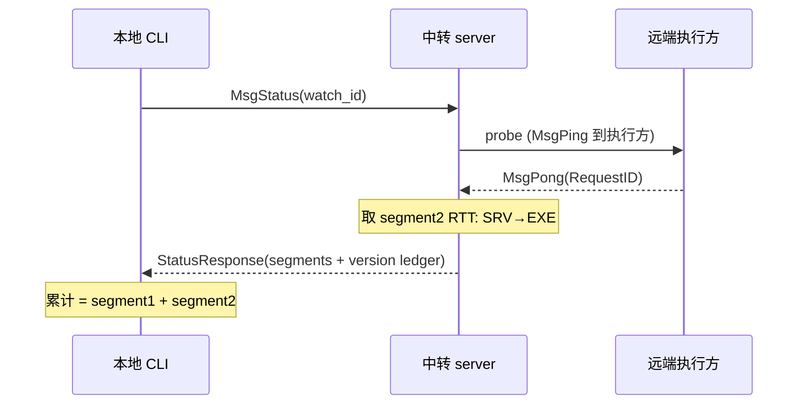

# Relay Status CLI - Plan

## Goal Capsule

- **Objective:** 让 `relay` CLI 具备一个一站式连通性体检命令 `relay status`:以"一条线上几个点"的视角逐段给出 本地→中转、中转→远端执行方、累计 的链路时延,并附各端点版本台账;伴随收敛职责——删除 `ping`、把 `version` 收窄为纯本地。
- **Means:** 新增 `relay status` 命令及其跨层支持,其中关键的净新增机制是**中转代理探活远端执行方**(新增服务端的探针往返协调)。由此链路分段才成立(`KTD2`)。
- **Product authority:** 用户——分段呈现、后端覆盖策略、命令面收敛方向均在上游 brainstorm 中拍板确认。
- **Execution profile:** 代码。
- **Open blockers:** 无。

---

## Product Contract

> Product Contract 自上游 `ce-brainstorm` 计划原样保留(R1–R8 未改动,无 scope 变化,未做 ID 重组)。

### Summary

`relay status` 将是一站式连通性体检:给出 本地→中转、中转→远端执行方、本地累计 三段时延,并附各端点版本;吸收 `ping` 的职责并删除 `ping`,`version` 收窄为纯本地;以 `--json` 提供机器可读输出。目前 `ping` 只能测"本机→中转"这一腿,测不到远端执行方那段,这正是本次要补的。

### Problem Frame

现有 `relay ping` 只验证"本机→中转"这一段:对 relay 后端是一个 WebSocket 往返,对 fs-mcp 后端是读远端心跳文件的时效,对 jumpserver 后端直接报不支持。它既测不出"中转→远端执行方"那段,也因各后端对"存活"的定义参差而没有统一"这条线通不通"的答案。与此同时 `version -r` 已在跨机查版本,信息职责散落在不同命令——没有一条命令能把"链路断在哪、各端点各是什么版本"一次看清楚。

### Link topology

### Key Decisions

- **KD1 (session-settled: user-directed — chosen over 保留现有命令各司其职: 用户要一站看清连通与版本,不加分散命令名):** 新增 `relay status` 作为连通性与版本的一站式命令。Governs R1。
- **KD2 (session-settled: user-directed — chosen over 保留为纯轻量别名: status 最低也含"本地→中转"单跳,是 ping 的覆盖超集,保留仅添职责重叠):** 删除 `ping` 子命令。Governs R4。
- **KD3 (session-settled: user-directed — chosen over 保留 `version -r` 的远端台账: 台账职责归并向唯一的一站式命令):** `version` 收窄为纯本地构建信息,远端台账职责由 `status` 承接(原 `version -r`)。Governs R3, R5。
- **KD4 (session-settled: user-directed — chosen over 所有后端都输出相同段数: 分段取测仅 relay 后端具备,其余只能尽力而为):** "几个点"的分段链路仅对 relay 后端成立;其它后端(local/fs-mcp/jumpserver)尽力而为,能给出段即给,不能给出的段显式标记"不可用",保持统一列结构。Governs R7。
- **KD5 (session-settled: user-directed — chosen over 整条命令报失败: 执行方离线时"中转在线"仍是有效结论):** 远端执行方不在线/未注册时,中转→执行方 段的时延标记为"不可用"+注明远端离线,整条命令不因此失败——语义是"中转在线、远端掉线"。Governs R2。
- **KD6 (session-settled: user-directed — chosen over 仅文本输出: 与 `version` 的 JSON 先例对齐,便于脚本/告警消费):** `status` 提供 `--json` 机器可读输出。Governs R6。

### Requirements

**连通链路**

- **R1.** `relay status` 单命令按"本地→中转、中转→远端执行方、本地累计"三段给出 一条链路时延。
- **R2.** 当某一段取不到值时(如远端执行方离线),该段在输出中标为"不可用"并注明断点;整条命令不因此失败,"本地→中转"段始终尽量给出。
- **R3.** `status` 一并给出参与端点版本(中转、各在线执行方),承接原 `version -r` 的台账职责。

**命令面**

- **R4.** 删除 `ping` 子命令(不再提供)。
- **R5.** `version` 收敛为纯本地构建信息,不再自动查询远端台账。
- **R6.** `status` 支持 `--json` 机器可读输出,字段与文本视图一致。

**后端覆盖**

- **R7.** 完整三段仅在配置为 relay 后端时成立;对其余后端(local/fs-mcp/jumpserver)尽力而为,不能给出的段显式标记"不可用",保持统一列结构、便于脚本对齐。

**目标选择**
- **R8.** `relay status` 优先使用显式 `-w`,否则按 cwd 推断;推断失败则列出可用清单退出;单次命令针对一个 watch。

### Key Flows

- **F1. relay 后端、执行方在线 — 全链路 (Covers R1, R3)**
  - **Trigger:** 本地运行 `relay status`(relay 后端、执行方已注册)。
  - **Steps:** 本地向中转发起 status 请求并计时(段1);中转向该执行方发专用探针并计时(段2);累计 = 段1 + 段2(均取本地单程视角)。
  - **Outcome:** 三段时延 + 各端点版本完整呈现。

- **F2. relay 后端、执行方离线 — 降级呈现 (Covers R2)**
  - **Trigger:** 运行 `relay status`,watch 的执行方不在线 / 未注册。
  - **Outcome:** 段1 正常给出,"中转→执行方"标"不可用"并注明执行端;命令正常结束(`--json` 对应字段留空)。

### Acceptance Examples

- **AE1 (Covers R1, R8):** relay 后端、执行方在线时运行 `relay status -w web-app-patches`,输出包含 本地↔中转、中转↔执行方、本地累计 三段及其时延,以及各端点 build 版本。
- **AE2 (Covers R1, F2):** 停掉执行方后运行 `relay status`,本地→中转段仍正常,中转→执行方段标"不可用 / 执行方离线",命令正常结束(不因离线而判失败);`--json` 中对应字段为空。
- **AE3 (Covers R4):** 运行 `relay ping` 得到"未知命令 / 命令不存在"。
- **AE4 (R5):** `relay version` 仅自动输出本机构建信息,不再展示远端台账。
- **AE5 (Covers R1, R7):** 在 fs-mcp 后端配置下运行 `relay status`,给出该后端可测的一段时延,其余段标"不可用",列结构与 relay 后端一致(`--json` 对应字段为空)。

### Scope Boundaries

- **Deferred for later:** 连续打点数 / 丢包 / 抖动统计(`-n`/`-t`);`--all` 全量批量。
- **Outside this product's identity:** 内置监控告警 / 退出码语义——脚本化消费交给 `--json` 的调用方,不在 CLI 内置告警。

### Dependencies / Assumptions

- **前提:** 中转已维护各 watch 在线执行方的 `executors` / `executorVers` 台账(`internal/relay/server/server.go`),并能定向把请求发到指定执行方(`SendTo`)。该现状已具备。
- **Assumption:** 一旦实现 KTD3 的中转探活协调,"中转→执行方"段的延迟即可被测量。

### Outstanding Questions (deferred to planning)

- 服务端探活等待的超时窗口取值(bounded timeout)在实现时按经验 micro-bench 定。

---

## Planning Contract

### Key Technical Decisions

- **KTD1. 新增 `MsgStatus` 协议消息与 `StatusResponse` 载体。** 在 `internal/relay/protocol/message.go` 增加 `MsgStatus MessageType = "status"` 与 `StatusResponse`(三段延迟 + 各在线执行方版本台账)。路由按 `msg.Type` 分发,与既有 `MsgVersion`/`MsgPing` 一致,并在 `docs/relay-protocol.md` 对应新增消息说明。Supports R1, R3。
- **KTD2. 执行方客户端应答中转发起的探针。** 执行方客户端目前只处理入站 `MsgPong`(作已连接的看门狗),不处理入站 `MsgPing`。在 `internal/relay/client/client.go` 的 `handleMessage` 增加 `MsgPing → MsgPong`(回响 `RequestID`),镜像 `internal/relay/server/client.go:113` 的写法。这是中转能对执行方测 RTT 的前提。Supports R1, R3。
- **KTD3. 中转新增"待回包"协调表用于探活执行方。** 服务端目前没有"发出→等回包"的协调(map: `pending`),`reqOwner` 只用于把执行方回包转发回请求方。为探活,需要在 `internal/relay/server/server.go` 新增 `pending map[string]chan *protocol.Response`(镜像客户端 `pending`),配合 `GetExecutor` + `SendTo` 对指定执行方发探针、带超时等回包,再把测得延迟与台账组装成 `StatusResponse` 回给请求方。这是本次唯一的净新增底层机制。Supports R1, R2, R3, R6。
- **KTD4. `Status` 方法挂在 relay 后端上(relay-backend 专属)。** 新增 `RelayBackend.Status(ctx)` 返回中转侧探活结果 + 台账;CLI 用现有 `queryRemoteVersions` 同款的方式把 `backend` 断言成 `*relaybackend.RelayBackend` 再调用。不用改抽象接口 `FileTransferBackend`(探活是 中转+执行方 专属,非 relay 端用退化策略)。Supports R1, R6, R8。
- **KTD5. 只删 CLI 的 `ping` 子命令,保留 `backend.Ping`。** `runExec` 预检仍调用 `b.Ping` 做健康检查(`cmd/relay/main.go`)。删 `pingCommand`/`pingWatch`/`dispatch case`/`runPing`;`version` 去掉 `-r` 远端台账分支、仅留本地构建信息(`--json` 仍保留)。Supports R4, R5。

### High-Level Technical Design

三段链路探活时序(relay 后端主路径):

段1 的 `CLI→SRV` RTT 由 CLI 本地用 `client.Ping` 计时,与 `MsgStatus` 互为独立,不在上图;中转在 `handleMessage` 内用探针测段2。等待探针回包(KTD3 的 pending map)只发生在该次 status 命令的处理内,用 bounded timeout 限制阻塞,不影响该连接的其它帧处理。

### Assumptions

- 中转进程是常驻的单实例进程(与 `executors` / `executorVers` 台账同一进程)。
- `commandDir` 现有心跳文件(`fs-mcp` 后端语义)在 relay 后端下不参与延迟计算。

### Sequencing

- U1 → U2 → U3(U2 是 U3 前置) → U4 → U5 → U6。U6 依赖 U4 存在(否则少了替换 ping 的入口)。

---

## Implementation Units

### U1. 协议:新增 `MsgStatus` / `StatusResponse`

- **Goal:** 为 status 交付给协议层的新消息与载体类型,供本地/中转/执行方多端解复用。
- **Requirements:** R1, R3
- **Dependencies:** 无
- **Files:**
  - `internal/relay/protocol/message.go`
  - `docs/relay-protocol.md`
- **Approach:**
  1. 在 `message.go` 增 `MsgStatus MessageType = "status"` 与 `StatusResponse` payload 结构(含三段 latency + 各端点版本 list)。
  2. 在 `docs/relay-protocol.md` 加一个类似 `4.x` 的消息小节,说明 `status` 语义与 `RequestID` 呼应。
- **Patterns to follow:** `MsgVersion`/`VersionResponse` 定义(`message.go`),协议文档的 `#### 4.x` 小节。
- **Test scenarios:**
  - Happy: 序列化/反序列化 `StatusResponse`(含三段数值与版本 list)往返一致。
  - Edge: `StatusResponse` 缺段时 nullable 延迟字段序列化为空(匹配 R2 语义)。
- **Verification:** `go test ./internal/relay/protocol/...` 通过;`StatusResponse` 可在测试中构造并往返。

### U2. 执行方应答中转探针

- **Goal:** 让已注册的执行方客户端能应答中转发起的探针,从而可测 `transit→executor` 段。
- **Requirements:** R1, R3
- **Dependencies:** U1
- **Files:**
  - `internal/relay/client/client.go`
  - `internal/relay/integration_test.go`
- **Approach:**
  1. 在 executor 方客户端的 `handleMessage` 增加 `case MsgPing`(`MsgPong` 回响 `RequestID`)。
  2. 该回包经执行方客户端的发送队列(`sendMessage`/`sendCh`,`writeLoop` 是唯一写者)发出,不要直接写连接;这与服务器侧 `server/client.go` 的 `Send` 不同。
  3. 注意该客户端既作为 CLI(请求方)也作为执行方,入站 `MsgPing` 仅在作为执行方时由中转方主动发来——补处理不影响请求方语义。
- **Patterns to follow:** `internal/relay/server/client.go:113`;`registerExecutorClient` 测试组件。
- **Test scenarios:**
  - Happy: 执行方客户端收到入站 `MsgPing` 后回 `MsgPong`(RequestID 一致)。
  - Integration: 中转对已注册执行方发探针能收到回包(供 U3 断言)。
- **Verification:** `go test -v -race ./internal/relay/...` 绿;探针回包进入 U3 的 pending map。

### U3. 中转探活 + status 装配(服务端 pending map)

- **Requirements:** R1, R2
- **Dependencies:** U1, U2
- **Files:**
  - `internal/relay/server/server.go`
  - `internal/relay/server/client.go`
  - `internal/relay/integration_test.go`
- **Approach:**
  1. `internal/relay/server/server.go` 新增 `pending map[string]chan *protocol.Response`(镜像 client `pending`)并配锁与超时。
  2. `internal/relay/server/client.go handleMessage` 增加 `case MsgStatus`:`GetExecutor(watch)` → 无则置段不可用;有则 `SendTo` 探针,在 pending 上带超时等回包、测 RTT。
  3. 组装 `StatusResponse`(段2延迟 + 台账 `ExecutorVersions`)并经 `SendResponse` 回请求方。
- **Relay/probe 专属:** 非 relay 后端的退化不在本单元的 `GetExecutor`/`Server` 层实现——非 relay 的"单跳可达 + 其余段标不可用"由 CLI(见 U5)承接,保持本单元职责归服务端探活。
- **帮定入站回包:** 执行方的探针回包(`MsgPong`)到达的是该执行方自己的连接;`server/client.go handleMessage` 需另加 `case MsgPong`(必要时含 `MsgResponse`/`MsgError`)按 `RequestID` 查 `Server.pending` 并把结果交给等待方(镜像 `client.go:294` 的解析),超时/失败路径严格清理 pending 条目。
- **Patterns to follow:** client `pending`(client.go:28/340-362)、`handlePushJob` 的目标执行方 + `reqOwner` 回传。
- **Test scenarios:**
  - Happy: 已注册执行方 → status 返回 段2(>0)与台账含中转+执行方。
  - Edge: 未注册执行方 → 段2 标不可用、台账不含执行方、命令仍成功。
  - Error: 探针超时(bounded timeout)→ 段2 置不可用而非全体失败。
- **Verification:** `go test -v -race ./internal/relay/...` 通过。

### U4. `RelayBackend.Status` + 分段计算

- **Requirements:** R1, R2, R3, R6
- **Dependencies:** U3
- **Files:**
  - `internal/relay/backend/relay.go`
  - `internal/relay/backend/relay_test.go`
- **Approach:**
  1. relay 后端加 `Status(ctx)`(经 `client.Ping` 取段1、经中转 status 取段2 + 台账,`累计 = 段1 + 段2`)。
  2. 返回字段与 `--json` 对齐的 `StatusSnapshot`。
- **Patterns to follow:** `RelayBackend.Version` 的 `ensureConnected` + `client.*` 装配;`TestEndToEnd_Version`。
- **Test scenarios:**
  - Happy: 端到端 relay 后端得到 三段 + 台账。
  - Edge: 执行方离线 → snapshot 段2 为空(标记不可用)。
- **Verification:** relay backend 端到端测试通过。

### U5. CLI `status` 子命令(含 `--json`、非 relay 退化)

- **Requirements:** R1, R2, R6, R7, R8(input: watch 解析)
- **Dependencies:** U4
- **Files:**
  - `cmd/relay/main.go`
- **Approach:**
  1. 声明 `statusCmd`(flag `-w`),加 `case statusCmd.FullCommand(): runStatus()`。
  2. `runStatus` 复用 watch 解析(`remote`/`lookupWatch`/`joinAvailable`/`GetWatchByID`);relay 后端走 U4 → 三段 + `--json`;非 relay 后端用 `b.Ping` 取单跳 + 其余段标"不可用",保持同一列结构。
- **Test scenarios:**
  - Happy(relay): `relay status` 文本输出三段与台账。
  - Happy(relay + `--json`): `--json` 输出字段可解析、段2/台账与文本一致。
  - Edge(non-relay/fs-mcp): 单跳可用、其余段标"不可用",列与 relay 一致。
- **Verification:** `go build ./...` 通过;手测 `relay status`/`relay status --json`。

### U6. 删除 `ping` CLI、`version` 收窄纯本地

- **Requirements:** R4, R5
- **Dependencies:** U4(需 status 先存在来承接)
- **Files:**
  - `cmd/relay/main.go`
  - `docs/README.md`(或 AGENTS.md 命令参考)
- **Approach:**
  1. 删除 `pingCommand`/`pingFlags`、`dispatch case pingCmd`、`runPing`。`backend.Ping` 保留。
  2. `version` 去掉 `-r/--remote` 远端分支,仅剩本地 + `--json`。
- **Test scenarios:**
  - CLI: `relay ping` → 未知命令。
  - Happy: `relay version` 不再自动输出远端台账(无 `-r` 行为的断言)。
  - Regression: `runExec` 预检不受影响(健康检查链路仍在→ `b.Ping` 保留)。
- **Verification:** `go build ./...`;`make test`。

---

## Verification Contract

- **Primary:** `make test`(`go test -v -race ./...`)全部通过。
- **Targeted:** `go test -v -race ./internal/relay/...`(integration + backend 端到端)。
- **Lint:** `make vet`(`go vet ./...`)。

执行单元 U1–U4 的探针/台账测试落在 `internal/relay/integration_test.go` 与 `internal/relay/backend/relay_test.go`;协议反序列化测在 `internal/relay/protocol`。

## Definition of Done

**全局:** `relay status`(relay 链路)产出一致的 三段时延 + 各端点版本;`Ping` 移除后 CLI 无 `ping`;`version` 仅本地。`make test` 与 `make vet` 通过。命令删除期间不残留死代码路径引用。

**每单元:**
- U1: `MsgStatus`/`StatusResponse` 落地并被两端解复用,协议文档已更新。
- U2: 执行方应答探针,集成可往返。
- U3: 中转对执行方探针的 RTT 入 `StatusResponse`,离线段可标记"不可用"且整命令不失败。
- U4: `RelayBackend.Status` 输出 snapshot + 台账,端到端测试绿。
- U5: `relay status`(+`--json`)文本/JSON一致,非 relay 退化标记;`relay ping` 不可执行。
- U6: `relay version` 不再查远端。

> Cleanup: 从中转协商期间产生的废弃客户端状态(临时 pending map 条目)在超时/失败路径上严格清除,不残留到关闭。