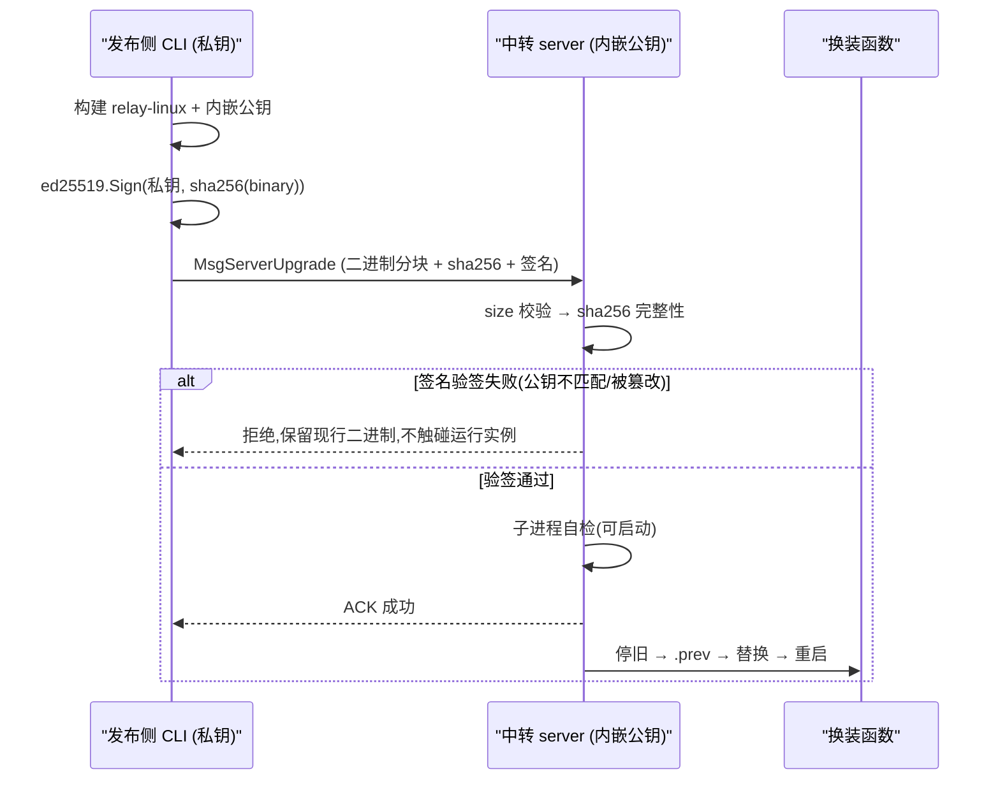
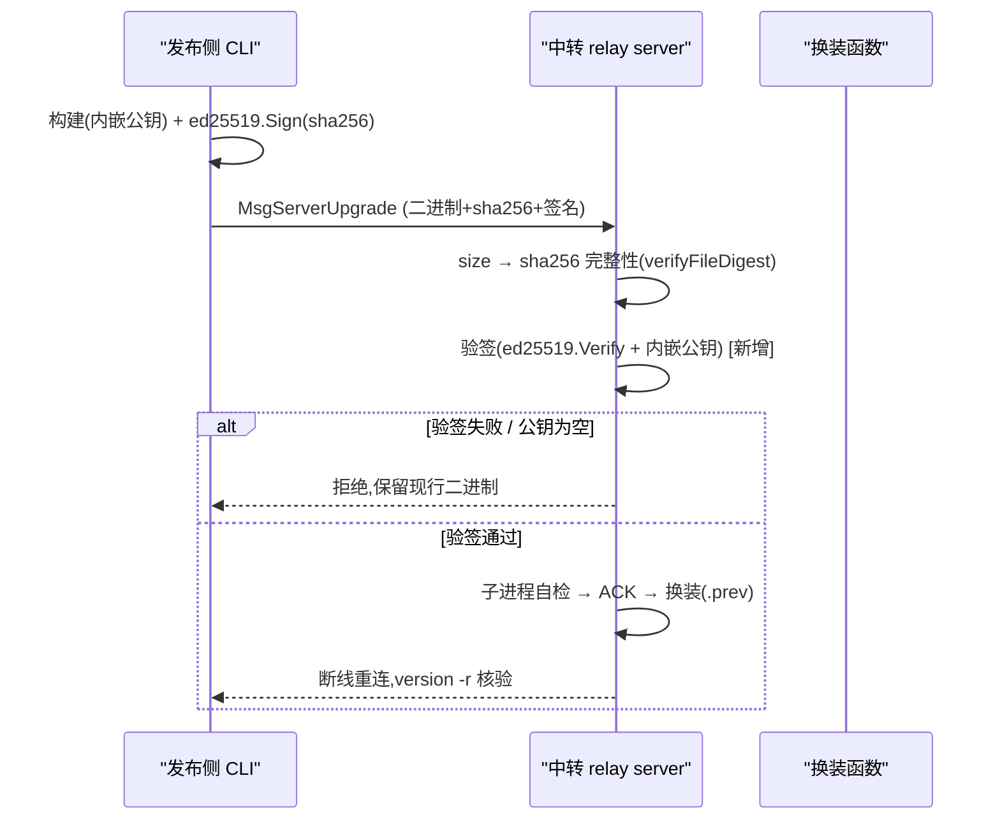

# 中转自升级加签名校验 - Plan

## Goal Capsule

- **Objective:** 给既有的中转「受控自升级」通道补一层**发布侧签名校验**：客户端用发布私钥对交付二进制的 sha256 摘要签名，中转用**内嵌进二进制**的发布公钥验签，验签通过才允许换装重启。目标是把信任从「token 持有者即可替换+重启中转」提升为「密码学可验证的来源可信」，从而堵住「token 泄露 → 任意代码执行 + 持久化」这一当前唯一高危风险。
- **Product authority:** 本计划只给既有自升级通道（`MsgServerUpgrade` / `server-remote` / `make deploy-transit`）加签名一层，不改变通道的鉴权、自检、`.prev` 备份、回退语义。密钥对生成/轮换、签名发布流程是新增配套。
- **Open blockers:** 无。签名算法（Ed25519）、验签公钥存放方式（内嵌进二进制）已由用户确定。

---

## Product Contract

### Summary

为 relay 的服务器自升级协议在既有「sha256 完整性 + 本地自检」之上，新增一层 Ed25519 签名真实性校验：发布侧私钥签名二进制的 sha256 摘要，签名随升级请求交付；中转用编译期经 `-ldflags` 注入的发布公钥验签，验签失败即中止，不触碰现行二进制。据此把自升级的信任锚从静态 token 提升为密码学公钥，即使 token 泄露也无法伪造合法升级。

### Problem Frame

现有自升级通道的安全姿态（见 `docs/relay-protocol.md` §4.6）是：**token 鉴权 + sha256 完整性 + 本地自检**。但正如文档明确声明的，「token 持有者可替换并重启中转二进制」是**已知、已评审的信任扩展**——sha256 只证明「到达内容 == 发方声明」，不建立来源真实性。这意味着：**任何拿到 token 的人，都能上传任意二进制并替换中转，获得与中转进程同等的任意代码执行 + 持久化能力**。在 `docs/relay-positioning.md` 的风险评估中，这是 relay 当前唯一的「任意代码执行」级高危风险。

补齐方案是发布侧签名：把「谁有权发布新二进制」从「谁持有 token」收紧为「谁持有私钥」。攻击者即使窃取 token，只要拿不到私钥，就造不出带合法签名的二进制，升级通道直接拒绝——这是比静态 token 更硬的信任锚。

### Requirements

**签名与验签**

- R1. 新二进制由发布侧用 Ed25519 私钥对二进制的 **sha256 摘要**签名，签名以 base64 编码随 `MsgServerUpgrade` 请求携带交付。（对摘要签名而非整文件签名：复用既有 `verifyFileDigest` 算出的 sha256，改动最小，安全性等价。）
- R2. 中转用**内嵌进 relay 二进制**的发布公钥验签。验签失败即中止，不触碰现行二进制；不因验签失败自动回滚或降级。
- R3. 验签在既有校验链中**位于 sha256 完整性校验之后、子进程自检之前**插入：`size → sha256 → 签名验签 → 防降级版本门禁 → 自检 → ACK → 换装`。任一步失败即中止。

**信任与发布侧**

- R4. 发布公钥通过构建时 `-ldflags -X` 注入 relay 二进制；未注入公钥的构建（如开发/本地裸构建）**默认拒绝所有升级请求**（fail-closed），绝不在无公钥时放行——与既有「升级通道未配置 token 时默认关闭」的硬约束姿态一致。
- R5. 提供发布侧签名工具/命令：输入私钥 + 二进制 → 产出二进制摘要的 Ed25519 签名（base64）。签名发布流程（`make deploy-transit`）自动完成「构建 → 签名 → 上传」。
- R6. 私钥**绝不随二进制或部署分发**，只存于发布侧（构建机）安全位置；公钥经 `-ldflags` 编入二进制，私钥与公钥为 Ed25519 密钥对。

**安全边界**

- R7. 签名真实性验证的**语义上限**：只证明「交付内容确实由持私钥的发布者签发」，不改变鉴权（token 仍是访问控制）、自检（防损坏/可启动）或换装（`.prev` 备份、无自动回滚）等既有语义。签名是**补充**真实性锚，不是替代品。
- R8. **防重放/降级**：签名输入除二进制 sha256 外，还需绑定一个**单调递增的发布版本/提交号**（发布侧计算，随请求携带）；中转在签名验签通过后校验候选发布的版本号 **≥ 当前运行版本号**，拒绝重放旧签名 / 降级到含已披露漏洞的旧版，从而把「token 泄漏 → 任意代码执行」的缓解真正兑现（不只覆盖"新造代码无法伪造"，还覆盖"旧签名重放"）。

### Key Decisions

- **Ed25519 作为签名算法** `(user-chosen — chosen over RSA/ECDSA：Go 标准库 crypto/ed25519 原生支持、无第三方依赖、签名短、速度快；`session-settled`)` — Governs R1, R2.
- **公钥内嵌进二进制（而非 server.yaml 配置）** `(session-settled: user-directed — chosen over 配置文件：token 泄露也造不出合法签名，安全性最强；代价是轮换公钥需重新编译+重新部署；这也与本项目"远端无公网、无 admin"环境契合，公钥随二进制分发无需额外配置下发)` — Governs R2, R4.
- **对 sha256 摘要签名而非整文件签名** `(design：复用既有 verifyFileDigest 的摘要，改动最小；摘要签名在防篡改上与整文件签名等价，因二进制内容决定其 sha256)` — Governs R1.
- **未注入公钥时 fail-closed** `(design：与既有"升级通道未配 token 默认关闭"姿态一致；无公钥绝不放行升级，防裸构建意外开通)` — Governs R4.
- **签名不改动既有信任链其他环节**：token 鉴权（访问控制）、sha256（完整性）、自检（可启动）、`.prev`（回退）全部保留；签名只新增"真实性"一层。Governs R7.

### Key Flows

**F1. 签名发布 → 上传 → 验签换装（客户端 + 中转视角）**

- **Trigger:** 运行 `make deploy-transit`，目标中转在线且运行的是内嵌公钥的构建。
- **Actors:** 本地 relay CLI（发布侧，持私钥）；中转 `relay server`（持内嵌公钥）。
- **Steps:** 本地构建 `relay-linux`（stamp + 内嵌公钥）→ 用发布私钥对二进制 sha256 摘要签名 → 经 `MsgServerUpgrade` 携带二进制（流式分块）+ sha256 + 签名交付 → 中转 `size → sha256 → 用内嵌公钥验签 → 自检 →` 通过则先回执 ACK → 停旧/备份 `.prev`/换装/重启 → 客户端断线重连、轮询 `relay version -r` 核验。
- **Outcome:** 合法签名 → 升级成功；验签失败 → 中止、保留现行二进制，命令非零退出并提示（合法发布流程不产生验签失败）。

### Acceptance Examples

- AE1. **合法签名升级成功** — Given 发布侧用正确私钥签名、公钥内嵌于中转二进制；When 触发升级；Then sha256/验签/自检全通过，中转换装成功，`relay version -r` 显示新提交。Covers R1, R2.
- AE2. **被篡改二进制被拒** — Given 攻击者篡改交付二进制内容但沿用旧摘要/签名（或签名与内容不匹配）；When 触发升级；Then 验签失败，中转拒绝、现行二进制与运行中实例不受影响。Covers R2, R3.
- AE3. **私钥不匹配被拒** — Given 用错误私钥（非内嵌公钥对应私钥）签名；When 触发升级；Then 验签失败，升级中止。Covers R2.
- AE4. **未注入公钥 fail-closed** — Given 中转运行的是未内嵌公钥的裸构建；When 收到升级请求（即使 token 合法）；Then 升级通道一律拒绝，不进入验签/自检/换装。Covers R4.
- AE5. **完整性与验签顺序** — Given 交付的 sha256 与内容不一致；When 触发升级；Then 在签名验签之前即因 sha256 不一致而中止（验签不先于完整性执行）。Covers R3.
- AE6. **重放/降级被拒** — Given 交付的二进制带合法签名但 `ReleaseVersion` 不大于当前运行版本（攻击者重放旧发布）；When 触发升级；Then 防降级门禁拒绝、不换装，现行二进制与运行实例不受影响。Covers R8.

### Scope Boundaries

- 不改动既有自升级的**鉴权（token）、自检、`.prev` 备份、无自动回滚**语义——签名只新增"真实性"一层。
- 不引入**自动回滚**、不改动 `.prev` 人工回退路径。
- 不把签名机制推广到**文件交换通道**（push/pull/config-sync 等）——本计划只覆盖升级通道。
- 不实现**密钥管理基础设施**（如 KMS/HW 密钥），私钥存于发布侧安全位置即可（见 Dependencies/Assumptions）。
- 不改变 `server-remote` 的 CLI 形态与 `deploy-transit` 的一键流程，只在其内部增加签名步骤。

### Success Criteria

- SC-1. 一条 `make deploy-transit` 在**发布侧完成签名**、中转为**内嵌公钥构建**且在线时，一键完成升级：构建 → 签名 → 上传 → 验签 → 自检 → 换装 → `relay version -r` 核验同一新提交。
- SC-2. 任何「被篡改 / 私钥不匹配 / 未注入公钥」的升级请求均被中转拒绝，运行中的既有中转不受影响，命令以非零退出（AE2/AE3/AE4）。
- SC-3. 签名不改变既有失败语义：验签前任何失败仍保留 `.prev` 备份、无自动回滚（沿用既有自升级通道的失败语义；本计划不自造自动回滚）。

### Dependencies / Assumptions

- 依赖：既有 `MsgServerUpgrade` 自升级通道已存在（`internal/relay/server/client.go` 的 `handleServerUpgrade`/`finishServerUpgrade`/`verifyFileDigest`/`selfCheckBinary`），本计划在其校验链中插入验签。
- 依赖：`make deploy-transit` / `scripts/relay-deploy.sh transit` 的构建+上传流程已存在（U4 复用）。
- 前提（公钥轮换）：内嵌公钥意味着换公钥需重新编译+重新部署中转——本计划提供密钥对生成 + 重新构建即可完成轮换，不做运行时热更新公钥。
- **轮换执行方式（链式过渡）**：因为运行中的中转只认自己内嵌的那把公钥，换钥必须做成链式过渡，而非一次性弃旧换新：① 用旧私钥 A 签发"迁移构建"，该构建的产物内嵌新公钥 B（这样仍持 A 的在跑中转能接受它）；② 依序把所有中转升到 B 构建；③ 全部就位后，才在发布侧停用 A。链式过程中保留旧私钥 A（绝不先弃 A 再迁），否则仍持 A 的中转将无法接受迁移构建、升级链路一次性断死。此 runbook 写入部署文档（配合 U6 文档单元）。
- 信任前提：发布侧私钥安全保存于构建机；中转内嵌公钥随二进制分发，无额外配置下发（契合无 admin 环境）。
- 密钥生成：首次需生成 Ed25519 密钥对（如 `openssl genpkey` 或 Go 一次性脚本），私钥存发布侧、公钥以 base64 供 `-ldflags` 注入。

### Outstanding Questions

- **Deferred to planning**：验签失败的精确错误码/错误消息措辞、签名在 `ServerUpgradeRequest` 中的字段名与 base64 编码约定、`-ldflags` 注入公钥的变量名、签名命令（`relay server-sign` 或独立脚本）的确切 CLI 形态、Makefile 里私钥路径的取用方式（环境变量 vs 固定路径）。—— 属实现选择，交由 planning 决定，不影响本计划产品行为。

---

## Planning Contract

### Key Technical Decisions

- **KTD1. `ServerUpgradeRequest` 增加 `Signature` 字段（base64），承载对二进制 sha256 摘要的 Ed25519 签名**：在 `internal/relay/protocol/message.go` 的 `ServerUpgradeRequest` 追加 `Signature string \`json:"signature,omitempty"\``；客户端签摘要后填此字段。校验沿用既有的 `req.Digest`（sha256 摘要），`Signature` 与 `Digest` 一起参与服务端校验。— Governs R1.
- **KTD2. 发布公钥经 `-ldflags -X` 注入，常量位置在 `internal/version`（或新增 package）**：定义 `var RelayUpgradePubKey string`（空默认），构建时 `-ldflags "-X <pkg>.RelayUpgradePubKey=<base64pubkey>"` 注入 base64 编码的 Ed25519 公钥。服务端在验签前读取该变量，为空即 fail-closed（R4）。— Governs R2, R4.
- **KTD3. 服务端验签插入 `finishServerUpgrade` 的 `verifyFileDigest` 之后、`selfCheckBinary` 之前**：新增 `verifyUpgradeSignature(...)`：由既有 `verifyFileDigest` 拿到二进制 sha256 → `base64.StdEncoding.DecodeString(expectedSig)` → `ed25519.Verify(pubKey, signedDigest, sig)`（`signedDigest` = 对 sha256 摘要与发布版本号的规范化联合，见 KTD7），任一失败即 `os.Remove(tmpBin)` + `SendError`，不触碰现行二进制；验签通过后再做防降级版本门禁（KTD7）。pubKeyB64 为空（未注入）即拒绝。— Governs R2, R3, R4, R8.
- **KTD7. 防降级版本门禁**：`ServerUpgradeRequest` 增加 `ReleaseVersion string`（单调发布版本，取 `git describe`/构建 stamp 或显式递增序号）；发布侧把它与 sha256 摘要一起纳入签名输入（`signedDigest = sha256(concat(digest, "\x00", releaseVersion))`，或直接签名 32 字节摘要 + 4 字节版本，实现端统一）。中转在 KTD3 验签通过后比较 `ReleaseVersion` 与当前运行版本：候选 < 当前 → 拒绝（防重放/降级），否则放行自检+换装。— Governs R8.
- **KTD4. 发布侧签名：新增 `relay server-sign` 子命令（或脚本内联）**：输入 `--binary` 路径、`--key` 私钥路径（Ed25519 PEM）与发布版本号，读取二进制 → 计算 sha256 → 对「sha256 摘要 + 发布版本」的规范化联合 `ed25519.Sign(privKey, signedMessage)` → 输出 base64 签名（stdout 或 `.sig` 文件）。`scripts/relay-deploy.sh transit` 构建后用该命令签名，把签名与版本号传给客户端 `server-remote`。私钥路径经环境变量（如 `RELAY_SIGN_KEY`）注入，不硬编码进脚本。— Governs R5, R6, R8.
- **KTD5. 客户端 `UpgradeServer` 增加签名透传**：`internal/relay/client/exec.go` 的 `UpgradeServer` 与 `internal/relay/backend/relay.go` 的封装增加签名参数，填入 `MsgServerUpgrade` 的 `Signature` 字段；`cmd/relay/main.go` 的 `server-remote` 从命令行/脚本接收签名。— Governs R1, R5.
- **KTD6. 密钥对生成工具**：新增一次性 Go 工具（或文档化 `openssl`/`go run` 一行）生成 Ed25519 私钥（PEM）+ 公钥（base64），产出供 `-ldflags` 注入与 `server-sign` 使用。— Governs R6.

### High-Level Technical Design

发布侧持私钥、客户端持内嵌公钥。客户端 `make deploy-transit` 流程：构建 `relay-linux`（`-ldflags` 注入公钥 + stamp）→ `relay server-sign --binary relay-linux --key $RELAY_SIGN_KEY --release <version>` 产出 base64 签名 → `relay server-remote` 携带二进制 + sha256 + 签名 + 发布版本上传。中转 `finishServerUpgrade` 在既有 sha256 校验后、自检前插入 `verifyUpgradeSignature`：用内嵌公钥验签「摘要+版本」联合体，验签失败即拒；验签通过后再做防降级版本门禁（候选版本 ≥ 当前运行版本，否则拒）；未注入公钥即 fail-closed。通过后走既有 `selfCheckBinary → ACK → 换装` 路径。

### Implementation Constraints

- 验签**必须在 sha256 完整性校验之后**执行，绝不能先验签后验完整性（防被篡改内容用合法签名蒙混）。
- 未注入公钥（`RelayUpgradePubKey == ""`）时**fail-closed**，拒绝所有升级请求，绝不放行。
- 私钥只在发布侧出现，绝不进入仓库、二进制或部署物；公钥以 base64 经 `-ldflags` 注入。
- 不改变既有 `.prev` 备份、无自动回滚、token 鉴权语义（R7）。

---

## Implementation Units

### U1. 协议层：`ServerUpgradeRequest` 增加 `Signature` 与 `ReleaseVersion` 字段

**Goal** 为升级请求增加签名与发布版本承载字段，使客户端能随摘要一起交付签名、并携带单调发布版本供防降级。

**Requirements:** R1, R8

**Files**
- modify `internal/relay/protocol/message.go` — 在 `ServerUpgradeRequest` 追加 `Signature string \`json:"signature,omitempty"\`` 与 `ReleaseVersion string \`json:"release_version,omitempty"\``。
- modify `internal/relay/protocol/message_test.go` — RoundTrip 覆盖新字段。

**Approach**
- `ServerUpgradeRequest` 追加 `Signature`（base64 Ed25519 签名，对应「sha256 摘要 + 发布版本」联合体）与 `ReleaseVersion`（单调发布版本，KTD7）。
- 保持 `Digest` 字段为 sha256 摘要、`Size`、`StreamID` 不变。
- 参照 `ConfigSyncRequest`/`PushJobRequest` 的字段风格，两字段均可选字符串（对旧客户端/旧协议不强制，由服务端 R4/R8 的 fail-closed 兜底）。

**Test scenarios**
- U1-T1 `ServerUpgradeRequest` 带 `Signature` 与 `ReleaseVersion` 的 RoundTrip 编码/解码，两字段原样保留。
- U1-T2 `Signature`/`ReleaseVersion` 为空时的 RoundTrip（空字段不丢字段）。

**Verification**：`go test ./internal/relay/protocol/...`。

### U2. 发布公钥注入点：`-ldflags` 常量

**Goal** 定义发布公钥的注入点，使服务端能读取内嵌公钥验签，且未注入时 fail-closed。

**Requirements:** R2, R4

**Files**
- modify `internal/version/version.go`（或新增 `internal/upgradesig/pubkey.go`）— 定义 `var RelayUpgradePubKey string`（base64，空默认）。
- modify `Makefile` — 构建目标（`build-linux`/`build-release`/`build-windows`）增加 `-ldflags "-X <pkg>.RelayUpgradePubKey=${RELAY_PUBKEY}"` 注入（公钥经环境变量 `RELAY_PUBKEY` 提供，未设置则留空）。
- modify `AGENTS.md` — 记录 `RELAY_PUBKEY` 注入约定。

**Approach**
- 新增一个包级变量 `RelayUpgradePubKey string`，默认为空；通过 `-ldflags -X` 注入 base64 公钥。
- `Makefile` 在 `build-linux`（deploy-transit 用的目标）注入 `${RELAY_PUBKEY}`；未设置时留空，配合服务端 fail-closed 拒绝升级。
- 文档化：发布生产构建前必须设置 `RELAY_PUBKEY`，否则升级通道关闭。

**Test scenarios**
- U2-T1 未注入（变量为空）→ 服务端校验逻辑应走 fail-closed（配合 U3 测试）。
- U2-T2 注入后 → 变量持有 base64 公钥（构建期验证，编译成功即证）。

**Verification**：`go build` 成功；`go test ./internal/version/...`（若该包有测试）。

### U3. 服务端验签：`finishServerUpgrade` 插入验签步骤

**Goal** 中转在 sha256 校验后、自检前用内嵌公钥验签，失败即中止。

**Requirements:** R2, R3, R4

**Files**
- modify `internal/relay/server/client.go` — 在 `finishServerUpgrade` 的 `verifyFileDigest` 与 `selfCheckBinary` 之间新增验签调用；新增 `verifyUpgradeSignature` 函数。
- modify `internal/relay/server/client_test.go`（或 `internal/relay/integration_test.go`）— 验签成功/失败/未注入公钥三态覆盖。

**Approach**
- 在 `finishServerUpgrade` 中，`verifyFileDigest(tmpBin, expectedDigest)` 通过后，调用新增的 `verifyUpgradeSignature(tmpBin, expectedDigest, req.Signature, RelayUpgradePubKey)`（四参形式，与 KTD3 一致；`expectedDigest` 复用 `verifyFileDigest` 已算出的摘要，不再重复计算）。
- `verifyUpgradeSignature` 逻辑：
  1. `RelayUpgradePubKey == ""` → 返回错误（fail-closed，R4）。
  2. `expectedSig == ""` → 返回错误（无签名即拒）。
  3. `base64.StdEncoding.DecodeString(expectedSig)` 失败 → 返回错误。
  4. `base64.StdEncoding.DecodeString(RelayUpgradePubKey)` 失败 → 返回错误。
  5. 用发布版本号经 KTD7 构造签名输入 `signedMsg = 规范化(sha256Digest ‖ ReleaseVersion)`，`ed25519.Verify(pubKey, signedMsg, sig)`，失败返回错误。
- 任一失败：`os.Remove(tmpBin)` + `c.SendError(reqID, "server upgrade: signature verification failed: ...")`，不触碰现行二进制。
- 验签通过后，再做 **KTD7 防降级版本门禁**：解析 `req.ReleaseVersion` 与当前运行版本（`internal/version`）比较，候选版本 < 当前 → `os.Remove(tmpBin)` + `SendError("server upgrade: downgrade rejected")`，不触碰现行二进制。
- 门禁通过后，继续既有 `selfCheckBinary → ACK → swapServerUpgrade` 路径。校验链顺序：`size → sha256 → 签名验签 → 防降级版本门禁 → 自检 → ACK → 换装`（R3）。

**Test scenarios**
- U3-T1 合法签名 + 更新版本（正确私钥 + 内嵌对应公钥 + `ReleaseVersion` 递增）→ 验签 + 版本门禁均通过，进入自检/换装（AE1）。
- U3-T2 被篡改二进制（内容与摘要/签名不符）→ 验签失败，拒绝且现行二进制不受影响（AE2）。
- U3-T3 错误私钥签名 → 验签失败，升级中止（AE3）。
- U3-T4 未注入公钥（`RelayUpgradePubKey == ""`）→ fail-closed，拒绝，不进入验签（AE4）。
- U3-T5 sha256 完整性失败 → 在验签之前即中止（顺序正确，AE5）。
- U3-T6 签名缺失（`Signature == ""`）→ 拒绝。
- U3-T7 既有成功路径升级测试（`TestIntegration_ServerUpgrade_ACK` / `_Swap` / `TestIntegration_ClientUpgradeServer`）需与本特性同步：在测试中通过 `internal/version.RelayUpgradePubKey` 注入一对测试公钥并签名载荷，使其在 fail-closed 落地后仍能断言「自检+ACK+换装」成功——否则这些既有无符号、无公钥的用例在验签生效后会一律 fail-closed 而红。计划已把该改造纳入 U3 范围。
- U3-T8 **合法签名但 `ReleaseVersion ≤` 当前运行版本（重放旧发布）→ 防降级门禁拒绝，不换装、不触碰当前状态**（R8 关键场景）。

**Verification**：`go test ./internal/relay/...`（含 client/integration 测试）全绿，且既有升级成功路径测试在注入测试公钥后仍通过。

### U4. 发布侧签名工具：`relay server-sign`

**Goal** 提供签名命令，使发布侧能用私钥对二进制摘要签名。

**Requirements:** R5, R6

**Files**
- modify `internal/daemon` 或新增签名包（如 `internal/upgradesig/sign.go`）— `SignBinary(path, privKeyPEM) (signatureBase64, error)`。
- modify `cmd/relay/main.go` — 新增 `relay server-sign --binary <path> --key <pem>` 子命令，输出 base64 签名。
- modify `scripts/relay-deploy.sh` — `transit()` 构建后调用签名（私钥经 `$RELAY_SIGN_KEY` 环境变量），把签名传给 `server-remote`。

**Approach**
- `SignBinary`：读二进制 → 计算 sha256 → `ed25519.Sign(privKey, sha256)` → base64 编码返回。
- `server-sign` 子命令：解析 `--binary` 与 `--key`（Ed25519 PEM 私钥路径），输出 base64 签名到 stdout。
- 私钥读取：解析 Ed25519 PEM（`x509.ParsePKCS8PrivateKey` / `pkcs8`），支持 `openssl genpkey -algorithm ED25519` 生成的 PEM 格式。
- `deploy-transit` 流程：构建 `relay-linux` → `relay server-sign --binary relay-linux --key $RELAY_SIGN_KEY` 得签名 → `relay server-remote --signature <sig> ...`。私钥经环境变量，不硬编码路径。

**Test scenarios**
- U4-T1 `SignBinary` 对已知二进制 + 私钥产出稳定 base64 签名（确定性，Ed25519 签名确定）。
- U4-T2 私钥与公钥配对的验签往返：`SignBinary` 产出 → 用对应公钥 `ed25519.Verify` 通过。
- U4-T3 私钥路径不存在/格式非法 → 返回错误、非零退出。

**Verification**：`go test ./internal/upgradesig/...`（或对应包）；手动 `relay server-sign` 冒烟。

### U5. 客户端透传 + 端到端整合

**Goal** 客户端 `UpgradeServer`/`server-remote` 透传签名，使 `make deploy-transit` 端到端完成「构建 → 签名 → 上传 → 验签 → 换装」。

**Requirements:** R1, R5, R7

**Files**
- modify `internal/relay/client/exec.go` — `UpgradeServer` 增加签名参数，填入 `MsgServerUpgrade.Signature`。
- modify `internal/relay/backend/relay.go` — `UpgradeServer` 封装增加签名参数透传。
- modify `cmd/relay/main.go` — `server-remote` 增加 `--signature` 参数。
- modify `internal/relay/integration_test.go` — 端到端：签名上传 → 中转验签 → 换装成功链路。
- modify `scripts/relay-deploy.sh`、`Makefile` — 一键流程整合签名。

**Approach**
- `UpgradeServer` 增加 `signature string` 参数，写入 `ServerUpgradeRequest.Signature`。
- `server-remote` 增加 `--signature <base64>` 参数（由脚本传入，或读取 `.sig` 文件）。
- `deploy-transit`：构建 → `server-sign` 签名 → `server-remote --signature` 上传 → 中转验签 → 断线重连 `version -r` 核验。
- 签名流程对既有 `server-remote` 用法向后兼容：`--signature` 缺省时仍可发起（但中转 fail-closed 会拒绝，除非是开发自检环境）。

**Test scenarios**
- U5-T1 端到端合法签名：构建 + 签名 + 上传 → 中转验签通过 → 换装成功 → `version -r` 核验同一提交（AE1）。
- U5-T2 端到端被篡改：篡改二进制后签名不匹配 → 中转拒绝、命令非零退出、`.prev` 保留（AE2）。
- U5-T3 未注入公钥的裸中转 → 升级被拒（AE4）。

**Verification**：`go test ./internal/relay/...`；手动 `make deploy-transit` 冒烟（见 Verification Contract）。

### U6. 密钥生成与文档

**Goal** 提供密钥对生成方式并更新文档，使发布侧能完成首次公钥注入与签名。

**Requirements:** R5, R6, R7

**Files**
- modify `docs/relay-protocol.md` — §4.6 补充签名校验说明、信任边界更新（真实性从 token 提升为公钥）、fail-closed 说明。
- modify `docs/relay-positioning.md` — 风险表中「自升级通道安全边界」缓解项标记为已实现（签名）。
- modify `AGENTS.md` / `README.md` — 记录密钥生成、`RELAY_PUBKEY`/`RELAY_SIGN_KEY` 注入与签名发布流程。
- modify（或新增）`scripts/` — 文档化密钥生成一行命令（`openssl genpkey -algorithm ED25519`）或提供 `go run` 工具。

**Approach**
- 文档化密钥对生成：`openssl genpkey -algorithm ED25519 -out relay-sign.key` 生成私钥；导出公钥 base64 供 `RELAY_PUBKEY` 注入。
- 更新协议文档的安全信任表：从「token 持有者即可替换+重启」改为「需持有发布私钥的签名」。
- 明确：未设置 `RELAY_PUBKEY` 的生产构建会关闭升级通道（fail-closed）。

**Test scenarios**
- U6-T1 文档中的密钥生成步骤可复现（生成私钥 + 公钥 base64）。
- 其余为文档性变更，无行为测试。

**Verification**：文档更新完成；`make test` 全绿。

---

## Verification Contract

- 单元/集成测试：`make test`（= `go test -v -race ./...`）必须通过。
- 协议层：`go test ./internal/relay/protocol/...`
- server/client 层：`go test ./internal/relay/...`（含 `integration_test.go`）
- 签名工具：`go test ./internal/upgradesig/...`（或对应包）
- 端到端冒烟（可选但强烈建议）：在本地生成密钥对，`make deploy-transit` 一键跑通（构建 → 签名 → 上传 → 验签 → 换装 → `version -r` 核验）；被篡改/错误私钥/未注入公钥场景命令非零退出。
- 不改变既有红线：token 鉴权、自检、`.prev` 备份、无自动回滚语义保持不变。

## Definition of Done

全局完成标准：
- `make test` 全绿，无回归。
- 签名链路完整贯通：`-ldflags` 注入公钥 → `server-sign` 用私钥签名 → `server-remote` 上传 → 中转 sha256 后、自检前验签 → 换装重启。
- 未注入公钥 fail-closed（R4）。
- 被篡改 / 错误私钥 / 缺失签名均被中转拒绝，不触碰现行二进制（AE2/AE3/U3-T6）。
- 文档（协议、定位、AGENTS）已同步签名机制与密钥生成（U6）。

各单元 DoD：
- U1：协议 RoundTrip 测试绿。
- U2：`-ldflags` 注入可用，未注入时变量为空。
- U3：验签成功/失败/未注入公钥测试绿。
- U4：`relay server-sign` 产出可验签签名，测试绿。
- U5：`make deploy-transit` 端到端签名升级通；篡改/错误签名非零退出。
- U6：文档同步。

---
